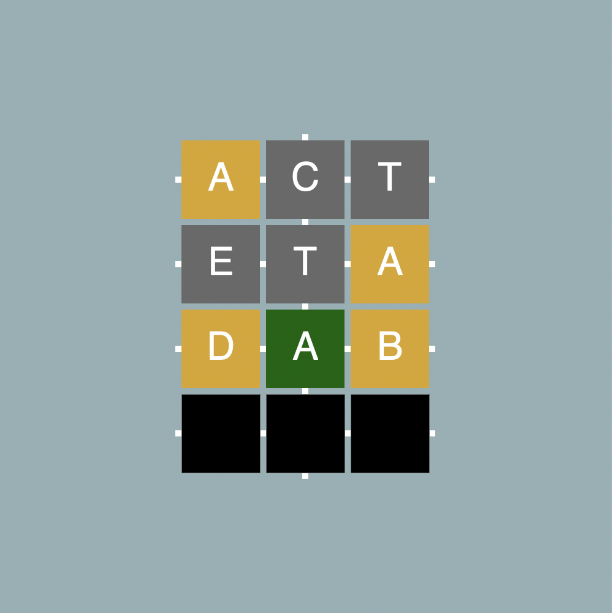
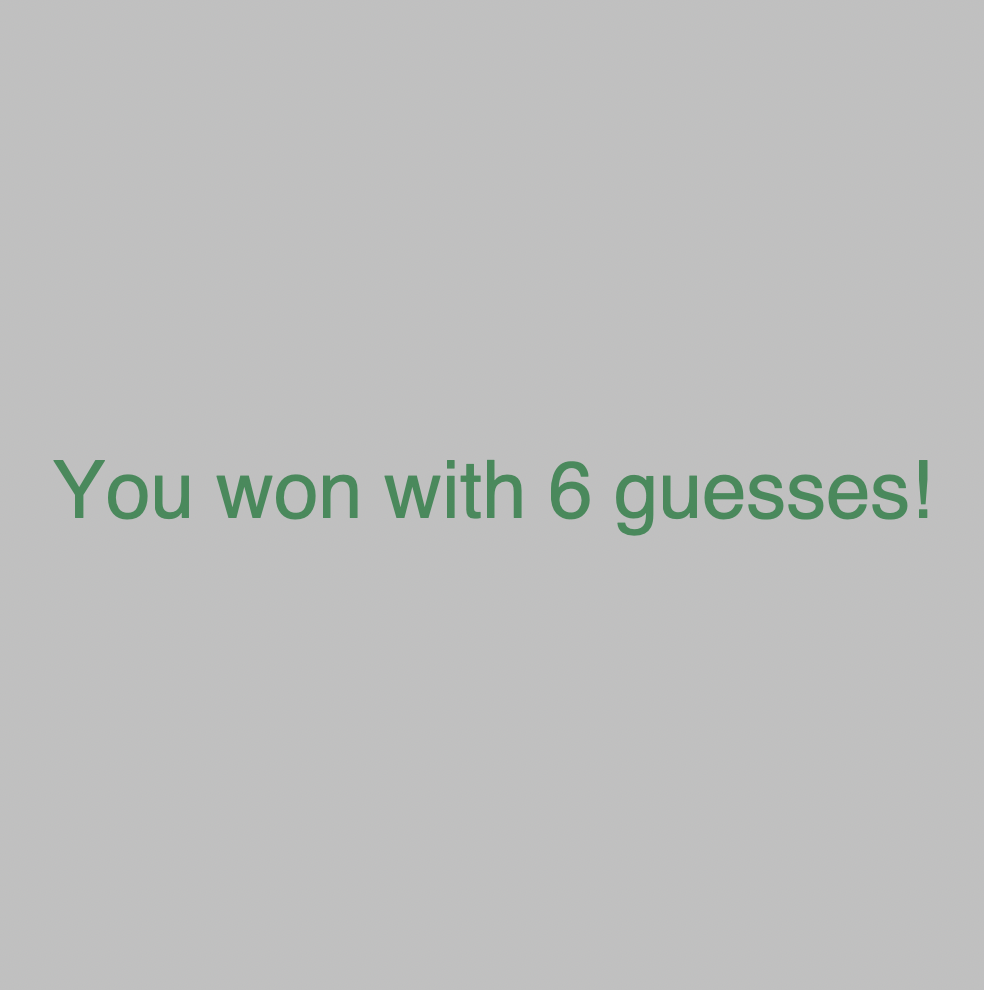

# Wordle

A mini Wordle game implemented in Racket.

## How to play

### Prerequisites
1. DrRacket
2. (Optional) A folder for the word lists

### Starting a game
1. Open the `wordle.rkt` file in DrRacket
2. Set the language to `Intermediate Student with lambda`
3. Call the `play` function and pass in the arguments at the bottom of the file:
   - 1st: Target word for player to guess
   - 2nd: Number of guesses allowed
   - 3rd: Path to a TXT file with a list of words

#### Start Example 
```racket
(play "act" 4 "words.txt")
```

### Logistics
- If you get the word correct, the game will display a victory window and tell you how many guesses it took to win.
- If you lose, you will get a defeat window.

### Controls

- Any letter - Fills in a slot with that letter
- Backspace (`\b`) - Removes the last letter typed
- Enter (`\r`) - Enters the word for scoring

### Color Codes

<div>
  <p>
    
    
    
  </p>
</div>

### Gameplay 
<div>
   <p>
      
      
   </p>
   <p>
      
      
   </p>
</div>